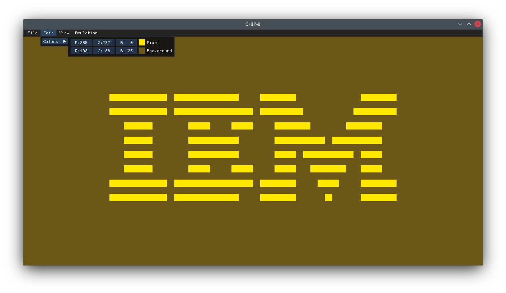
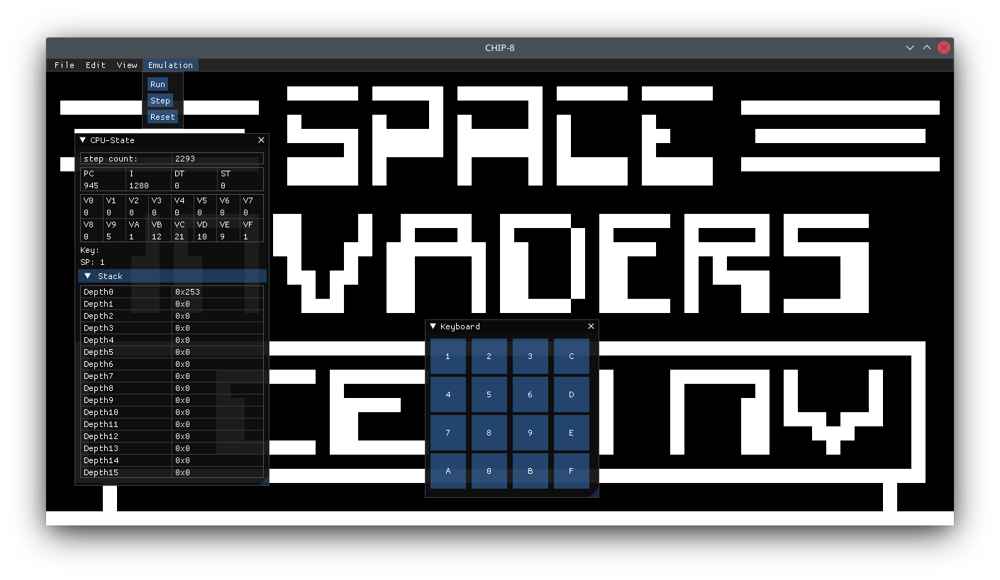

# Chip-8
chip-8 interpreter written in c++ using GLFW, Opengl and ImGui.

## Screenshots

## References
https://tobiasvl.github.io/blog/write-a-chip-8-emulator/

http://devernay.free.fr/hacks/chip8/C8TECH10.HTM

https://learnopengl.com/
